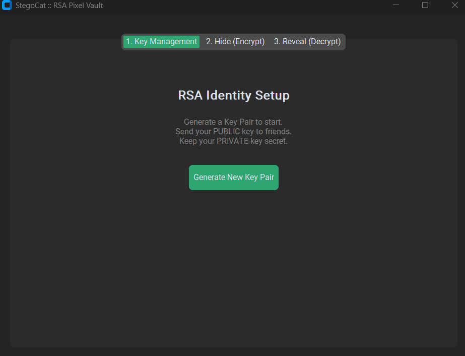
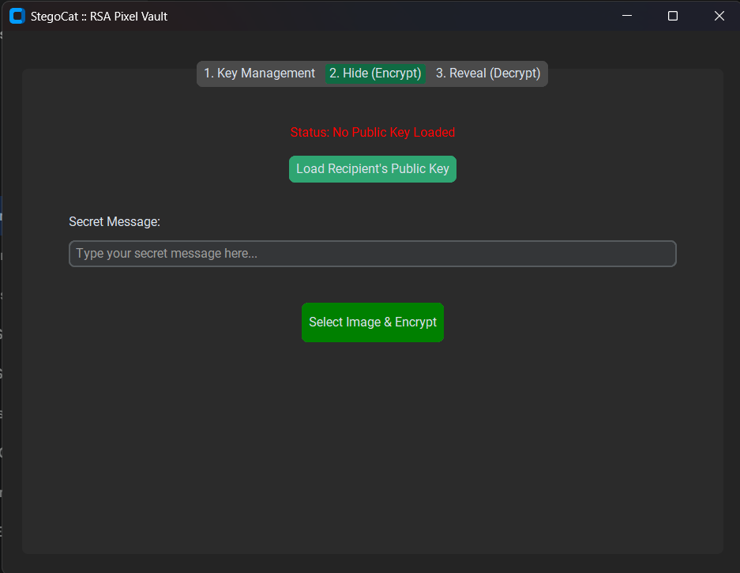
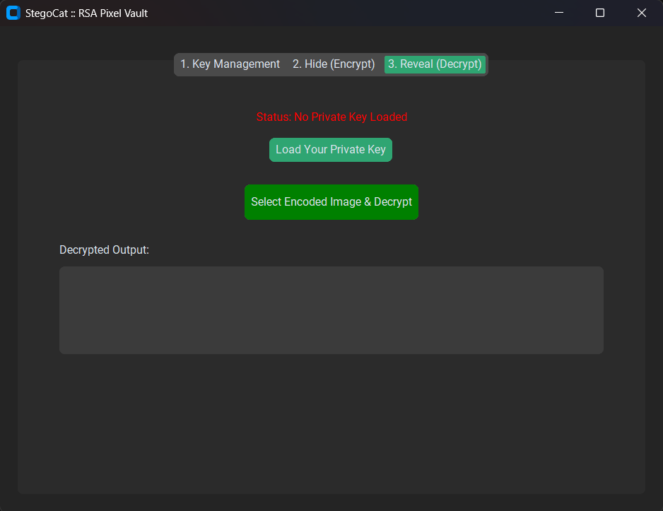

# StegoCat Vault

RSA-encrypted steganography tool for hiding encrypted messages inside lossless images.


## Overview

StegoCat Vault is a Python desktop app that combines RSA public-key encryption with least significant bit image steganography. It lets a user encrypt a text message with a recipient's public key, hide the encrypted payload inside an image, and recover the message only with the matching private key.

The project is intended as a cybersecurity and applied cryptography portfolio project. It demonstrates key generation, PEM key storage, asymmetric encryption, binary payload handling, LSB image encoding, and a simple dark desktop interface.

## Screenshots

| Key Management | Hide / Encrypt | Reveal / Decrypt |
| --- | --- | --- |
|  |  |  |

## Features

- RSA key-pair generation with PEM-formatted public and private keys
- Public-key message encryption before embedding
- LSB steganography for hiding encrypted bytes in PNG output
- Length-prefixed payload protocol to avoid delimiter corruption
- Dark `customtkinter` desktop interface
- PNG output enforcement to avoid lossy compression damage

## Tech Stack

- Python
- customtkinter
- Pillow
- cryptography

## Installation

```bash
python -m venv .venv
.venv\Scripts\activate
pip install -r requirements.txt
```

On macOS/Linux:

```bash
python3 -m venv .venv
source .venv/bin/activate
pip install -r requirements.txt
```

## Usage

```bash
python main.py
```

1. Open the Key Management tab.
2. Generate a public/private key pair.
3. Share the public key with the sender and keep the private key secure.
4. Use the Hide tab to encrypt a message and save an encoded PNG.
5. Use the Reveal tab with the private key to decrypt an encoded PNG.

## Technical Notes

Earlier delimiter-based steganography approaches can fail if encrypted binary data happens to contain the delimiter sequence. StegoCat Vault uses a length-prefixed protocol instead:

1. Store a fixed-size header with the payload length.
2. Read exactly that number of payload bits during extraction.
3. Decrypt the recovered byte sequence with the matching private key.

This makes extraction deterministic and avoids trailing garbage bytes.

## Limitations

- This is an educational portfolio project, not a professionally audited security product.
- Output should remain lossless; editing, resizing, or recompressing an encoded image can destroy hidden data.
- RSA payload size is limited, so this app is best for short messages.
- It does not implement hybrid encryption or authenticated encryption yet.

## Future Improvements

- Add hybrid encryption with a random symmetric key for longer messages.
- Add message authentication or signatures.
- Add automated tests for encode/decode round trips.
- Add drag-and-drop image loading.
- Package the app as a standalone desktop executable.

## License

MIT
